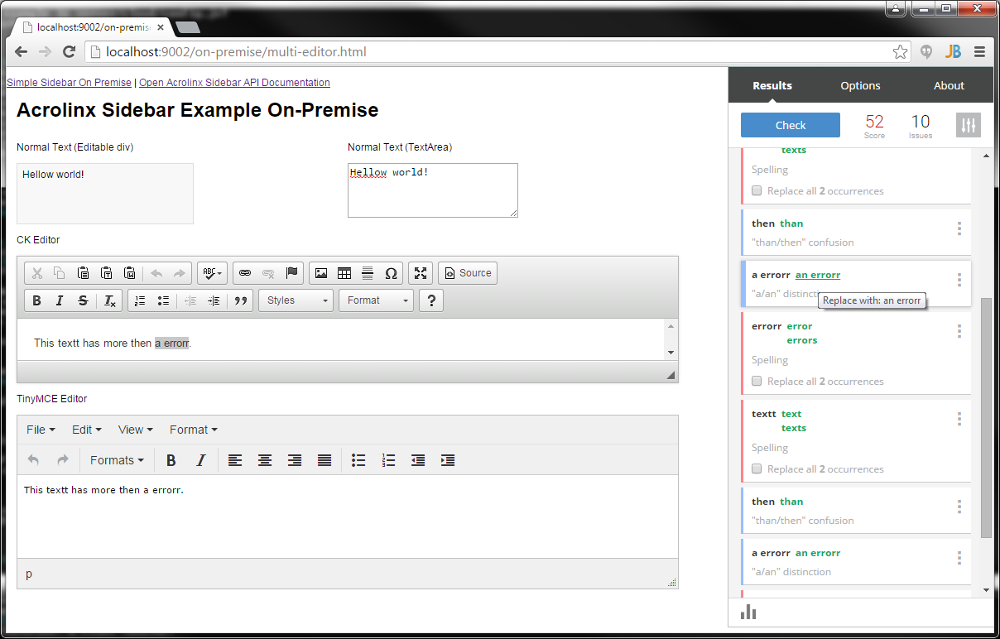

# Acrolinx Sidebar Demo

[](https://github.com/acrolinx/acrolinx-sidebar-demo/actions/workflows/main.yml)
[](https://sonarcloud.io/summary/new_code?id=acrolinx_acrolinx-sidebar-demo)

This is a showcase for integrating the [Acrolinx](https://www.acrolinx.com/) Sidebar into a web application.

See: [Getting Started with Custom Integrations](https://docs.acrolinx.com/customintegrations)

## Live Demo

[Acrolinx Sidebar Web Live Demo](https://acrolinx.github.io/acrolinx-sidebar-demo/samples/index.html)

## The Acrolinx Sidebar

The Acrolinx Sidebar is designed to show up beside the window where you edit your content.
You use it for checking, reviewing, and correcting your content.
To get an impression what the Sidebar looks like in existing integrations, have a look at
[Get Started With the Sidebar](https://docs.acrolinx.com/coreplatform/latest/en/the-sidebar/get-started-with-the-sidebar).

## Prerequisites

Please contact [Acrolinx SDK support](https://github.com/acrolinx/acrolinx-coding-guidance/blob/master/topics/sdk-support.md)
for consulting and getting your integration certified.
This sample works with a test license on an internal Acrolinx URL.
This license is only meant for demonstration and developing purposes.
Once you finished your integration, you'll have to get a license for your integration from Acrolinx.
  
Acrolinx offers different other SDKs, and examples for developing integrations.

Before you start developing your own integration, you might benefit from looking into:

* [Getting Started with Custom Integrations](https://docs.acrolinx.com/customintegrations),
* the [Guidance for the Development of Acrolinx Integrations](https://github.com/acrolinx/acrolinx-coding-guidance),
* the [Acrolinx SDKs](https://github.com/acrolinx?q=sdk), and
* the [Acrolinx Demo Projects](https://github.com/acrolinx?q=demo).

## Getting Started

### Run Locally in a Web Browser

1. Make sure, that you have installed NodeJS that includes npm.
2. In your console navigate into the projects root folder and install all the required node modules with:

   ```bash
   npm install
   ```

3. Now you can start the development server by typing:

   ```bash
   npm start
   ```

4. Now open [http://localhost:3000/samples](http://localhost:3000/samples) in your web-browser.
5. Choose the sample, that you want to see. Use `https://partner-dev.internal.acrolinx.sh/` as the Acrolinx URL.

   

   The best entry point might be the Multi-Editor Example.

### Using the SDK

To install the SDK to your npm-based Acrolinx Integration project call:

```bash
npm install acrolinx-sidebar-sdk
```

### Integration Boilerplate Sample

See: [Boilerplate using Node and NPM](samples/boilerplate/README.md)

### Configuration

See: [config.js](samples/config.js)

## SDK Features

The SDK provides [adapters](https://github.com/acrolinx/sidebar-sdk-js/tree/main/src/adapters) for:

* `contentEditable` `div`-elements,
* `input` text elements,
* CodeMirror,
* CKEditor,
* Xeditor,
* TinyMCE, and a
* `MultiEditorAdapter` that can be used to combine different adapters as one document.

If you need to support other editors, sometimes the `ContentEditableAdapter` works without any changes.
If not, implement the [`AdapterInterface`](https://github.com/acrolinx/sidebar-sdk-js/blob/main/src/adapters/AdapterInterface.ts).

## References

* This DEMO is built on the [Sidebar SDK JS](https://github.com/acrolinx/sidebar-sdk-js).
* The Sidebar SDKs are based on the [Acrolinx Sidebar Interface](https://acrolinx.github.io/sidebar-sdk-js/).

## License

Copyright 2015-present Acrolinx GmbH

Licensed under the Apache License, Version 2.0 (the "License");
you may not use this file except in compliance with the License.
You may obtain a copy of the License at:

[http://www.apache.org/licenses/LICENSE-2.0](http://www.apache.org/licenses/LICENSE-2.0)

Unless required by applicable law or agreed to in writing, software
distributed under the License is distributed on an "AS IS" BASIS,
WITHOUT WARRANTIES OR CONDITIONS OF ANY KIND, either express or implied.
See the License for the specific language governing permissions and
limitations under the License.

For more information visit: [https://www.acrolinx.com](https://www.acrolinx.com)

