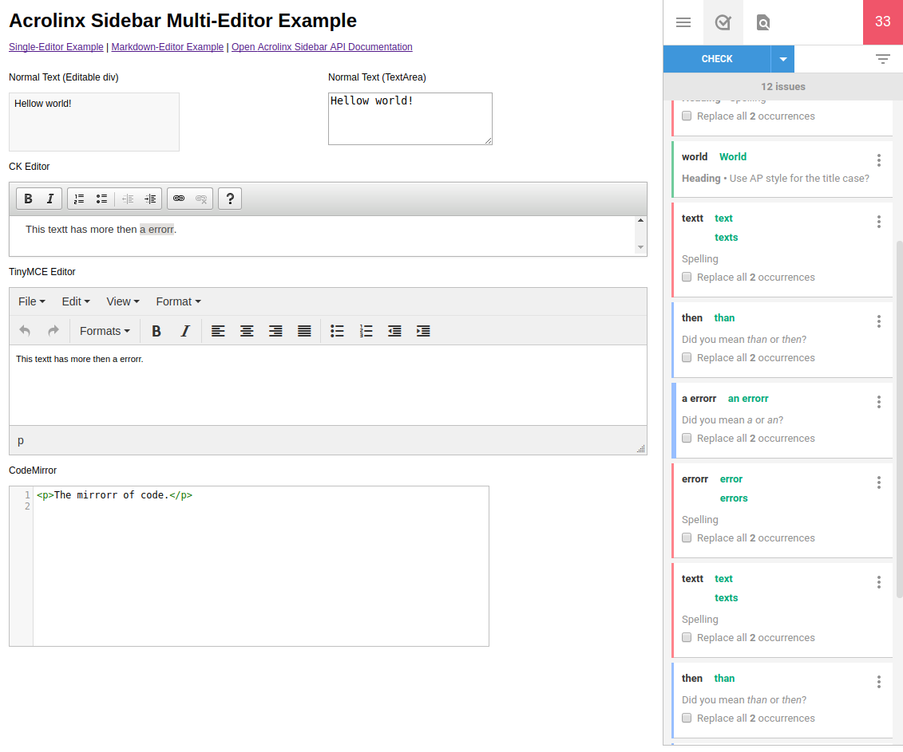

# Acrolinx Sidebar Demo

Showcase for an integration of the [Acrolinx](http://www.acrolinx.com/) sidebar into a web application, using the npm package
[acrolinx-sidebar-sdk](https://github.com/acrolinx/sidebar-sdk-js).
The library contains adapters to use in your web integration. These are ready to use for: Editable divs, input elements and rich text editors like CKEditor and TinyMCE.

See: [Getting Started with Custom Integrations](https://support.acrolinx.com/hc/en-us/articles/205687652-Getting-Started-with-Custom-Integrations)

## Live Demo

[Acrolinx Sidebar Live Demo](https://cdn.rawgit.com/acrolinx/acrolinx-sidebar-demo/v0.4.0/samples/index.html)

## Table of Content

[The Acrolinx Sidebar](#the-acrolinx-sidebar)

[Prerequisites](#prerequisites)

[Setting up the Sidebar Example](#setting-up-the-sidebar-example)

[License](#license)

## The Acrolinx Sidebar

The Acrolinx sidebar is designed to show up beside the window where you edit your content. 
You use it for checking, reviewing, and correcting your content. 
To get an impression what the sidebar looks like in other integration check the 
[Acrolinx Support Center](https://support.acrolinx.com/hc/en-us/articles/205594781-Acrolinx-Sidebar-Edition-User-Interface-Reference).

## Prerequisites

Please contact Acrolinx SDK support (sdk-support@acrolinx.com) for consulting and getting your integration certified.
This sample works with a test license on an internal acrolinx server. This license is only meant for demonstration and developing purposes.
Once you finished your integration you'll have to get a license for your integration from Acrolinx.
  
Please note that this an example for a integration into a web application only. 
Acrolinx offers different other SDKs for developing integrations. 

Before you start developing your own integration, you might benefit from looking into the sidebar example.

## Setting up the Sidebar Example

### Run the examples locally in a web browser

1. Make sure, that you have installed nodejs (which includes npm).

2. In your console navigate into the projects root folder and install all required node modules with:

    ```
        npm install
    ```

5. Now you can start the development server by typing:
  
   ```
       npm start
   ```
   
   Now open [http://localhost:3000/samples](http://localhost:3000/samples) in your web-browser. Choose the sample, that you want to see.
   You will see sidebars login page. If not already pre-filled type 'http://integration.acrolinx.com:8031' as the server 
   address and choose a username and a password to login. 
   
   
   
Within the sample client you can see how the sidebar interacts with different editors.
There are adapters for simple editable divs, input elements and rich text editors like CKEditor and TinyMCE ready to go.
You're integration can use these adapters and you'll won't have any headache about that.

[back to top](#table-of-content)

## License

Copyright 2015-2016 Acrolinx GmbH

Licensed under the Apache License, Version 2.0 (the "License");
you may not use this file except in compliance with the License.
You may obtain a copy of the License at

http://www.apache.org/licenses/LICENSE-2.0

Unless required by applicable law or agreed to in writing, software
distributed under the License is distributed on an "AS IS" BASIS,
WITHOUT WARRANTIES OR CONDITIONS OF ANY KIND, either express or implied.
See the License for the specific language governing permissions and
limitations under the License.

For more information visit: http://www.acrolinx.com

[back to top](#table-of-content)


