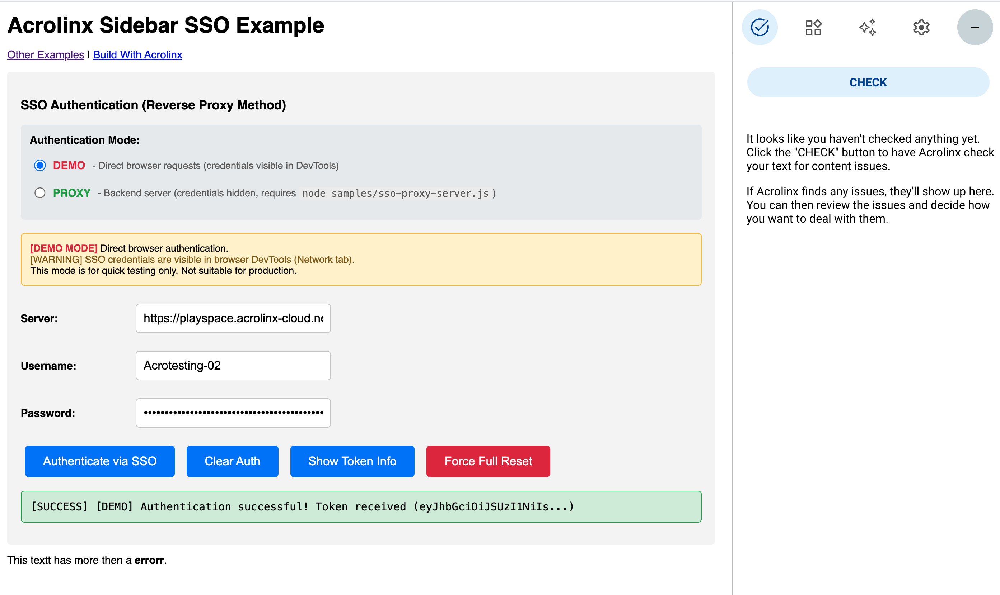
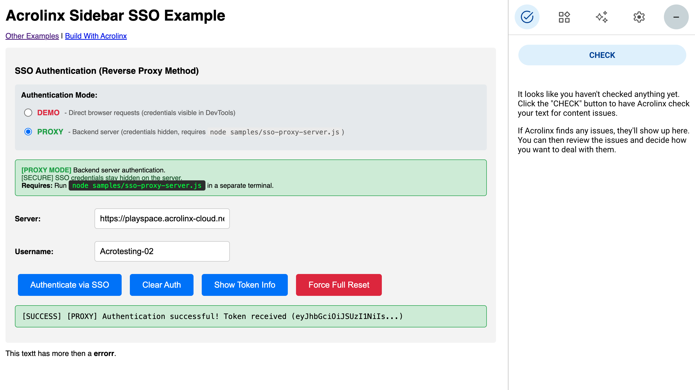

# Acrolinx SSO Authentication Guide

This guide explains how to implement Single Sign-On (SSO) authentication using the reverse proxy/generic password method to automatically authenticate users with the Acrolinx Sidebar without requiring them to click the "Sign In" button.

## Overview

The SSO authentication flow works as follows:

1. Your application authenticates with the Acrolinx server using the generic password (SSO_SECRET)
2. Acrolinx returns an access token
3. The access token is passed to the Sidebar SDK to auto-authenticate the user

---

> ### ⚠️ Critical Requirement - Don't Skip This!
> 
> When initializing the Acrolinx Sidebar with an SSO token, you **MUST** set:
> 
> ```javascript
> showServerSelector: false
> ```
> 
> **If you don't set this, your `accessToken` will be silently ignored** and the sidebar 
> will show the sign-in screen instead. This is the most common SSO implementation mistake.
> 
> See [Initialize Sidebar with Token](#initialize-sidebar-with-token) for details.

---

## Two Authentication Modes

This implementation supports **two modes** for flexibility:

| Mode | Security | Use Case | Requires Backend |
|------|----------|----------|------------------|
| **DEMO** | [WARNING] Credentials visible in browser | Quick testing, development | No |
| **PROXY** | [SECURE] Credentials hidden on server | Production, secure testing | Yes |

### DEMO Mode (Direct Browser Requests)

```
Browser ──────────────────────────────> Acrolinx Server
         Direct HTTPS request
         (credentials visible in DevTools)
```

- Browser makes direct HTTPS requests to Acrolinx server
- SSO credentials are visible in browser DevTools (Network tab)
- No backend server needed
- **Use for:** Quick testing and development only



### PROXY Mode (Backend Server)

```
Browser ──────> Proxy Server (3002) ──────> Acrolinx Server
                (credentials hidden)
```

- Browser requests go through `samples/sso-proxy-server.js`
- SSO credentials stay hidden on the server
- Requires running the proxy server on port 3002
- **Use for:** Production-like testing and deployment



### Why Browser Code Cannot Read `.env` Files

The `.env` file is **only accessible to server-side Node.js code**, not browser JavaScript. This is a fundamental security feature of web browsers.

| File | Environment | Can read `.env`? |
|------|-------------|------------------|
| `sso-proxy-server.js` | Node.js (server) | **Yes** |
| `sso-single-editor.html` | Browser (client) | No |
| `sso-config.js` | Browser (client) | No |

### Visual Architecture Comparison

```
DEMO MODE:                              PROXY MODE (recommended):
┌─────────────┐                         ┌─────────────┐
│   Browser   │                         │   Browser   │
│  (no .env)  │────── SSO ──────►       │  (no .env)  │──────┐
└─────────────┘      Request            └─────────────┘      │
      │                                                       │ username
      │ Password typed                                        │ only
      │ in form field                                         ▼
      ▼                                               ┌──────────────┐
┌───────────────┐                                     │ Proxy Server │
│    Acrolinx   │                                     │ (reads .env) │
│    Server     │                                     └──────────────┘
└───────────────┘                                            │
                                                             │ password from .env
                                                             ▼
                                                     ┌───────────────┐
                                                     │    Acrolinx   │
                                                     │    Server     │
                                                     └───────────────┘
```

**Key Takeaway:** If you set credentials in your `.env` file, you **must use PROXY mode** for them to be used. In DEMO mode, credentials must be entered manually in the browser form.

## Quick Start

### Prerequisites

```bash
# Install dependencies
npm install

# Start the main server (Terminal 1)
npm start
```

This starts BrowserSync on:
- Port 3000: Main server serving demo files
- Port 3001: BrowserSync admin UI

### DEMO Mode (Simplest)

1. Open http://localhost:3000/samples/sso-single-editor.html
2. **DEMO** mode is selected by default
3. Default credentials are pre-filled
4. Click **"Authenticate via SSO"**
5. The Sidebar will initialize with the authenticated session

### PROXY Mode (Recommended for Production Testing)

**First, set up environment variables:**
```bash
# Copy the example and edit with your credentials
cp .env.example .env
# Edit .env with your actual ACROLINX_SERVER_URL and ACROLINX_SSO_PASSWORD
```

**Terminal 1 - Main server:**
```bash
npm start
```

**Terminal 2 - Proxy server:**
```bash
node samples/sso-proxy-server.js
```

You should see:
```
============================================================
Acrolinx SSO Proxy Server
============================================================
Server running at: http://localhost:3002
Acrolinx Server:   https://your-server.acrolinx-cloud.net
Default Username:  your-username
Allowed Origins:   http://localhost:3000
Log Level:         INFO
============================================================
Endpoints:
  POST http://localhost:3002/api/sso/authenticate
  GET  http://localhost:3002/api/sso/status
============================================================
Tip: Set LOG_LEVEL=DEBUG for verbose output
============================================================
```

**Then in the browser:**

1. Open http://localhost:3000/samples/sso-single-editor.html
2. Select **PROXY** mode
3. Enter the username (password is handled by proxy server)
4. Click **"Authenticate via SSO"**
5. Watch the proxy server terminal for authentication logs

## Authentication Request

### JavaScript (Browser Console)

You can test the SSO authentication directly in your browser's console:

```javascript
// SSO Authentication Test - paste this in browser console
const response = await fetch('https://playspace.acrolinx-cloud.net/api/v1/auth/sign-ins', {
  method: 'POST',
  headers: {
    'X-Acrolinx-Client': 'QWNyb2xpbnhDTEk',
    'username': 'your-username',
    'password': 'YOUR_SSO_SECRET',
    'Content-Type': 'application/json'
  },
  body: ''
});

const data = await response.json();
console.log('Access Token:', data.data.accessToken);
```

### Using the Built-in Service

If you're on the SSO demo page, you can use the service directly:

```javascript
// Using AcrolinxSSOService (available on sso-single-editor.html)
const authData = await AcrolinxSSOService.authenticate({
  mode: 'demo',
  serverAddress: 'https://playspace.acrolinx-cloud.net',
  username: 'your-username',
  password: 'YOUR_SSO_SECRET'
});

console.log('Access Token:', authData.data.accessToken);
```

### Testing with Postman

For API testing, Postman works well:

| Setting | Value |
|---------|-------|
| **Method** | `POST` |
| **URL** | `https://playspace.acrolinx-cloud.net/api/v1/auth/sign-ins` |
| **Headers** | `X-Acrolinx-Client`: `QWNyb2xpbnhDTEk` |
| | `username`: `your-username` |
| | `password`: `YOUR_SSO_SECRET` |
| **Body** | Empty (or `{}`) |

### Request Headers Reference

| Header | Description |
|--------|-------------|
| `X-Acrolinx-Client` | Your Base64-encoded client identifier |
| `username` | The username to authenticate |
| `password` | The SSO secret/generic password configured on your Acrolinx server |

### Response

```json
{
  "data": {
    "accessToken": "eyJhbGciOiJSUzI1NiIsInR5cCI6IkpXVCJ9...",
    "expiresIn": 3600
  }
}
```

## Implementation Files

### 1. `samples/sso-config.js`

Client-side configuration and authentication service.

**Configuration (`window.ssoConfig`):**

| Property | Description |
|----------|-------------|
| `mode` | Authentication mode: `'demo'` or `'proxy'` |
| `serverAddress` | Acrolinx server URL |
| `proxyServerUrl` | Proxy server URL (default: `http://localhost:3002`) |
| `username` | Default username |
| `password` | SSO secret (DEMO mode only) |
| `clientSignature` | Client signature (base64 ID or JWT) |

**Service Methods (`window.AcrolinxSSOService`):**

| Method | Description |
|--------|-------------|
| `authenticate(options)` | Authenticate and get full response |
| `getAccessToken(options)` | Get access token (with caching) |
| `clearAuth(clearSidebarSession)` | Clear cached authentication |
| `isAuthenticated()` | Check if user has valid token |

### 2. `samples/sso-single-editor.html`

Complete working demo with:
- Mode selector (DEMO/PROXY toggle)
- Credential input fields
- Authentication controls
- Status display
- Acrolinx Sidebar integration

**UI Controls:**

| Button | Description |
|--------|-------------|
| **Authenticate via SSO** | Perform SSO authentication with current mode |
| **Clear Auth** | Clear SSO token cache and sidebar session |
| **Show Token Info** | Display current token and expiry |
| **Force Full Reset** | Clear all caches and reload page |

### 3. `samples/sso-proxy-server.js`

Node.js proxy server for secure SSO authentication.

**Features:**
- Keeps SSO_SECRET hidden from client-side code
- Configurable via environment variables
- CORS support with origin validation
- Configurable logging levels (DEBUG, INFO, WARN, ERROR)
- Health check endpoint

## Configuration

### Environment Variables for Proxy Server

| Variable | Required | Description | Default |
|----------|----------|-------------|---------|
| `ACROLINX_SERVER_URL` | **Yes** | Acrolinx server URL | (none) |
| `ACROLINX_SSO_PASSWORD` | **Yes** | SSO secret/generic password | (none) |
| `ACROLINX_SSO_USERNAME` | No | Default username for SSO | `default-user` |
| `ACROLINX_CLIENT_SIGNATURE` | No | Client signature (base64 ID or JWT) | (empty) |
| `SSO_PROXY_PORT` | No | Port for proxy server | `3002` |
| `ALLOWED_ORIGINS` | No | Comma-separated allowed CORS origins | `http://localhost:3000` |
| `LOG_LEVEL` | No | Logging verbosity | `INFO` |

**[NOTE]** Port 3001 is used by BrowserSync UI, so proxy uses 3002.

**[SECURITY]** No credentials are hardcoded. The server will not start without required variables.

**Multiple Origins Example:**

```bash
# Allow multiple origins (comma-separated, no spaces)
export ALLOWED_ORIGINS="http://localhost:3000,http://localhost:8080,https://myapp.example.com"

# Or in .env file:
ALLOWED_ORIGINS=http://localhost:3000,http://localhost:8080,https://myapp.example.com
```

### Log Levels

| Level | Description |
|-------|-------------|
| `DEBUG` | Verbose output - request/response details, headers, payloads (passwords redacted) |
| `INFO` | Standard operational messages (default) |
| `WARN` | Warning messages only |
| `ERROR` | Error messages only |

**Examples:**

```bash
# Standard logging
node samples/sso-proxy-server.js

# Verbose debugging
LOG_LEVEL=DEBUG node samples/sso-proxy-server.js

# Quiet mode (errors only)
LOG_LEVEL=ERROR node samples/sso-proxy-server.js
```

### Using a `.env` File

**[IMPORTANT]** The proxy server **requires** environment variables to run. No credentials are hardcoded.

1. Copy the example file:
```bash
cp .env.example .env
```

2. Edit `.env` with your actual values:
```env
# REQUIRED
ACROLINX_SERVER_URL=https://your-acrolinx-server.acrolinx-cloud.net
ACROLINX_SSO_PASSWORD=your-sso-secret

# OPTIONAL
ACROLINX_SSO_USERNAME=default-user
ACROLINX_CLIENT_SIGNATURE=your-client-signature
SSO_PROXY_PORT=3002
ALLOWED_ORIGINS=https://your-app.com
LOG_LEVEL=INFO
```

**[SECURITY]** Never commit your `.env` file! It's already in `.gitignore`.

## Programmatic Usage

### DEMO Mode (Direct Authentication)

```javascript
// Authenticate directly (credentials visible in browser!)
const authData = await AcrolinxSSOService.authenticate({
  mode: 'demo',
  serverAddress: 'https://your-server.com',
  username: 'user',
  password: 'sso-secret'
});
```

### PROXY Mode (Via Backend)

```javascript
// Authenticate via proxy server (credentials hidden)
const authData = await AcrolinxSSOService.authenticate({
  mode: 'proxy',
  username: 'user'
  // Password is handled by the proxy server
});
```

### Initialize Sidebar with Token

> **[CRITICAL - READ THIS FIRST]**
> 
> The most common mistake when implementing SSO with the Acrolinx Sidebar SDK:
> 
> **`showServerSelector` MUST be set to `false` for `accessToken` to work!**
> 
> If `showServerSelector` is `true` (or not set), the sidebar will ignore your access token
> and show the sign-in screen instead. This is the #1 cause of "SSO not working" issues.

```javascript
// Extract access token from response
const accessToken = authData.data.accessToken;

// Initialize Acrolinx Sidebar with SSO token
const acrolinxPlugin = new AcrolinxPlugin({
  serverAddress: 'https://your-acrolinx-server.com',
  sidebarContainerId: 'sidebarContainer',
  
  // ╔════════════════════════════════════════════════════════════════╗
  // ║  CRITICAL: Both settings below are REQUIRED for SSO to work!  ║
  // ╚════════════════════════════════════════════════════════════════╝
  showServerSelector: false,  // MUST be false - or accessToken is ignored!
  accessToken: accessToken    // The token from SSO authentication
});

acrolinxPlugin.registerAdapter(adapter);
acrolinxPlugin.init();
```

### Critical SSO Requirements

| Setting | Required Value | What Happens If Wrong |
|---------|---------------|----------------------|
| `showServerSelector` | `false` | Token is **ignored**, sign-in screen appears |
| `accessToken` | Valid JWT string | Authentication fails |

**Why does this happen?**

The Acrolinx Sidebar was designed to allow users to select their server when `showServerSelector: true`. 
In this mode, the sidebar manages its own authentication flow and ignores any provided `accessToken`. 
Setting it to `false` tells the sidebar: "I'm handling server selection and authentication - use my token."

**Available since:** Sidebar version 14.11.0

## API Reference

### Proxy Server Endpoints

| Endpoint | Method | Description |
|----------|--------|-------------|
| `/api/sso/authenticate` | POST | Authenticate with Acrolinx and get access token |
| `/api/sso/status` | GET | Health check (returns server status and log level) |
| `/` | GET | API documentation and usage info |

**Authentication Request:**

```bash
# Via proxy server
curl -X POST http://localhost:3002/api/sso/authenticate \
  -H "Content-Type: application/json" \
  -d '{"username": "your-username"}'
```

**Response:**

```json
{
  "data": {
    "accessToken": "eyJhbGciOiJSUzI1NiIs...",
    "expiresIn": 3600
  }
}
```

### AcrolinxSSOService Methods

```javascript
// Authenticate with specified mode
const authData = await AcrolinxSSOService.authenticate({
  mode: 'demo',        // or 'proxy'
  serverAddress: '...', // optional override
  username: '...',      // optional override  
  password: '...'       // required for demo mode, ignored in proxy mode
});

// Get access token (with caching)
const token = await AcrolinxSSOService.getAccessToken({
  mode: 'proxy',
  username: 'user'
});

// Check if authenticated (has valid cached token)
if (AcrolinxSSOService.isAuthenticated()) {
  console.log('User has valid token');
}

// Clear cached authentication
// Set true to also clear sidebar's localStorage session
AcrolinxSSOService.clearAuth(true);

// Switch mode programmatically
window.ssoConfig.setMode('proxy');
```

## Security Considerations

1. **Never expose SSO_SECRET in client-side code in production**
   - Use PROXY mode with the backend server
   - Store credentials in environment variables

2. **Use HTTPS in production**
   - Ensure all communication is encrypted
   - The proxy server should be behind a reverse proxy with SSL

3. **Restrict CORS origins**
   - Set `ALLOWED_ORIGINS` to only your trusted domains
   - Avoid using `*` in production

4. **Token storage**
   - Tokens are stored in `sessionStorage` (cleared when browser closes)
   - Sidebar may cache its own session in `localStorage`
   - Use "Force Full Reset" to clear all caches

5. **Token expiry**
   - Tokens typically expire in 1 hour
   - Re-authenticate when token expires

## Acrolinx Server Configuration

Your Acrolinx server needs to be configured to accept SSO authentication.

In `coreserver.properties`:

```properties
singleSignOn.genericPassword=your_SSO_SECRET_here
singleSignOn.allowedRemoteAddresses=<IP or host patterns for your proxy servers>
```

Contact your Acrolinx administrator to configure these settings.

## Troubleshooting

### Common Issues

| Issue | Solution |
|-------|----------|
| **SSO token works but sidebar shows sign-in screen** | **Most common issue!** Set `showServerSelector: false` in your init config. The sidebar ignores `accessToken` when this is `true`. |
| **Authentication fails with 401/403** | Verify SSO_SECRET is correct; Check username exists in Acrolinx; Ensure proxy IP is allowed |
| **Authentication fails with 400 (client signature missing)** | Ensure `clientSignature` is set in config or `.env` file |
| **CORS errors** | Add your domain to `ALLOWED_ORIGINS`; Ensure proxy server is running |
| **"Cannot connect to proxy server"** | Start proxy with `node samples/sso-proxy-server.js`; Check port 3002 is available |
| **Port 3002 already in use** | Kill existing process: `lsof -i :3002` then `kill <PID>` |
| **Sidebar still shows "CHECK" after clearing auth** | Click "Force Full Reset" to clear sidebar's localStorage cache |
| **Token expires quickly** | Implement token refresh logic; Check `expiresIn` value |

### Debug Mode

Run the proxy server with DEBUG logging to see detailed request/response information:

```bash
LOG_LEVEL=DEBUG node samples/sso-proxy-server.js
```

This will show:
- Full request headers
- Request body content
- CORS origin checks
- Response status and headers
- Full response data (with passwords redacted)

## References

- [Acrolinx SSO Documentation](https://support.acrolinx.com/hc/en-us/articles/10968875378706-Single-Sign-On-for-Standard-Stack)
- [Acrolinx Proxy Sample](https://github.com/acrolinx/acrolinx-proxy-sample)
- [Sidebar SDK JS](https://github.com/acrolinx/sidebar-sdk-js)
- [Sidebar Interface Documentation](https://acrolinx.github.io/sidebar-interface/)
- [Build With Acrolinx](https://support.acrolinx.com/hc/en-us/categories/10209837818770-Build-With-Acrolinx)
